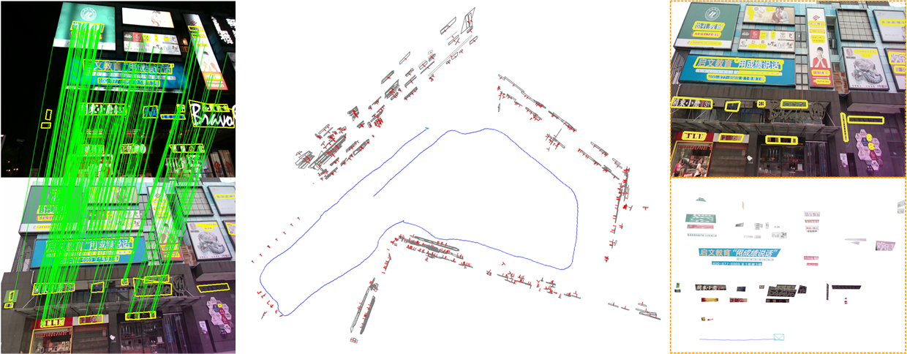

<!----> 

## TextSLAM

<div align=center>
   <b> TextSLAM: Visual SLAM with Semantic Planar Text Features</b>
</div>

<div align=center>
  <b>Authors:</b> &emsp;
  <a href=https://leeby68.github.io/>Boying Li</a> &emsp;
  <a href=https://drone.sjtu.edu.cn/dpzou/>Danping Zou</a> &emsp;
  <a href=>Yuan Huang</a> &emsp;
  <a href=>Xinghan Niu</a>  &emsp;
  <a href=https://www.researchgate.net/profile/Ling-Pei>Ling Pei</a>  &emsp;
  <a href=https://www.researchgate.net/profile/Wenxian-Yu>Wenxian Yu</a>
</div>


<!----> 
<!----> 

<div align=center >
  <!--[PAPER (ICRA2020)](https://ieeexplore.ieee.org/abstract/document/9197233/) &emsp; 是否可以增加paper list--> 
  <a href=https://arxiv.org/abs/2305.10029>PAPER</a> &emsp;
  <a href=https://github.com/SJTU-ViSYS/TextSLAM>CODE</a> &emsp;
  <a href=https://github.com/SJTU-ViSYS/TextSLAM>DATASET</a> &emsp;
  <a href=https://github.com/SJTU-ViSYS/TextSLAM>EVALUATION</a> 
</div>

### Motivation

:star: TextSLAM is a novel visual Simultaneous Localization and Mapping system (SLAM) tightly coupled with semantic text objects.

:bulb: Humans can read texts and navigate complex environments using scene texts, such as road markings and room names. **Why not robots?**

:star: TextSLAM explores scene texts as the basic feature both geometrically and semantically. It achieves superior performance even under challenging environments, such as image blurring, large viewpoint changes, and significant illumination variations (day and night).

<div align=center>
  
</div>

### Abstract

We propose a novel visual SLAM method that integrates text objects tightly by treating them as semantic features via fully exploring their geometric and semantic prior. The text object is modeled as a texture-rich planar patch whose semantic meaning is extracted and updated on the fly for better data association. With the full exploration of locally planar characteristics and semantic meaning of text objects, the SLAM system becomes more accurate and robust even under challenging conditions such as image blurring, large viewpoint changes,  and significant illumination variations (day and night). We tested our method in various scenes with the ground truth data. The results show that integrating texture features leads to a more superior SLAM system that can match images across day and night. The reconstructed semantic 3D text map could be useful for navigation and scene understanding in robotic and mixed reality applications.

### Method
<--! 几何图gif -->
<--! 语义图gif -->
<--! 总流程图 -->

### Additional Results
<--! Indoor gif -->
<--! IndoorLoop gif -->
<--! Mapping gif -->
<--! 室外 gif -->
<--! 白天夜晚 gif -->

### BibTeX
```
@article{li2023textslam,
  title={TextSLAM: Visual SLAM with Semantic Planar Text Features},
  author={Li, Boying and Zou, Danping and Huang, Yuan and Niu, Xinghan and Pei, Ling and Yu, Wenxian},
  booktitle={arXiv preprint},
  year={2023}
}

@inproceedings{li2020textslam,
  title={TextSLAM: Visual SLAM with Planar Text Features},
  author={Li, Boying and Zou, Danping and Sartori, Daniele and Pei, Ling and Yu, Wenxian},
  booktitle={IEEE International Conference on Robotics and Automation (ICRA)},
  year={2020}
}
```
### Contact
### Acknowledgements
